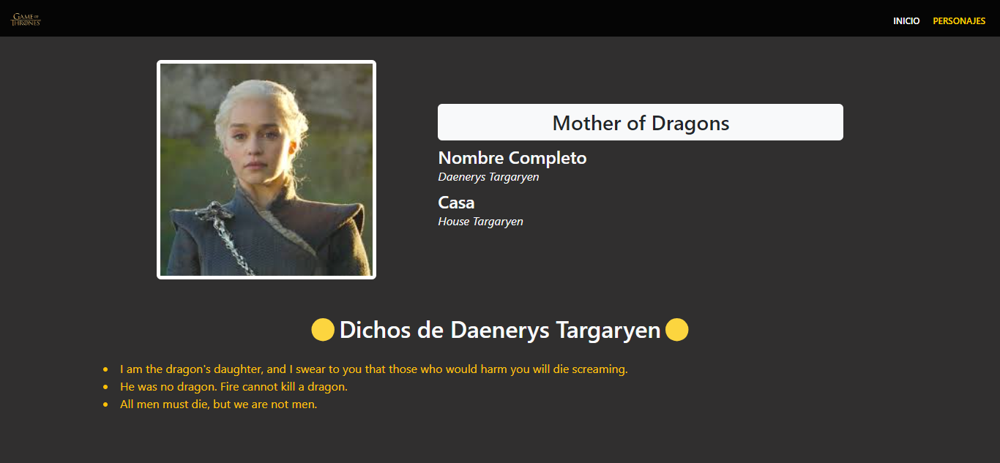

# App Game of thrones

App que muestra los personajes de game of thrones y tambien los dichos de cada uno.

## Instalación

Para instalar este proyecto, sigue estos pasos:

1. Clona el repositorio en tu máquina local:

   ```bash
   https://github.com/isDanydev/app-game-of-thrones.git

2. npm run install

## Librerias usadas

1. npm i react-router-dom

## Imagenes del app

1. Pagina Principal
  


2. Pagina Personajes
  


3. Pagina Vista detalle
  
